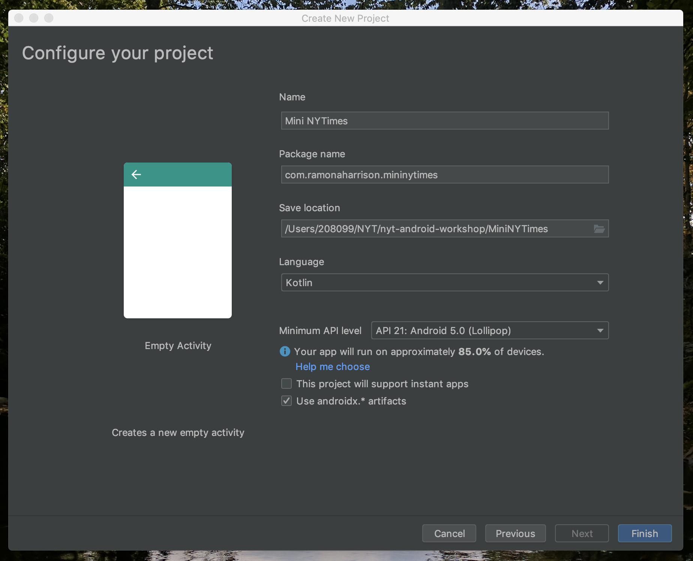

# Android Development Workshop

- Monday 2 - 4 p.m.: Intro to Android Development - 15W2-115 - [Zip of the completed project](Completed%20Project%20-%20Day%201/NYTimesMini2.zip)
- Tuesday 2 - 4 p.m.: Kotlin for Android Development - 15W2-115 - [Zip of the completed project](Completed%20Project%20-%20Day%202/NYTimesMini2.zip)
- Wednesday 2 - 4 p.m.: Advanced Android - 12E2-140

*Office hours from 4 - 5 pm each day.*

## The Goal

Build a NYTimes app using the [public API](https://developer.nytimes.com/):

https://developer.nytimes.com/


## Creating a project
- Open Android Studio
- "Start a new Android Studio project"
- "Empty Activity"


## Configure the project




## Getting around Android Studio

- Project panel
- Emulator
- Run button


## Enable developer options on your device!

- For participants with Android devices, go to: ```Settings > About phone > Build Number``` 
- Tap build number seven times. You’ll see a message saying “You are now a developer!”
- When you connect your device to your laptop, click **OK** on the alert that pops up.


## Edit the layout

- Open activity_main.xml
- Find the text that says "Hello World!"
- Replace it with your own message and run the app


## Displaying a list

- From activity_main.xml, open the "Design" tab
- Delete the `TextView`
- Drag to add a `RecyclerView`
- Give it an id: `recyclerView`


## Creating an adapter

In a new file NewsAdapter.kt

```kotlin
class NewsAdapter : RecyclerView.Adapter<NewsAdapter.NewsViewHolder>() {

    class NewsViewHolder(val headline: TextView) : RecyclerView.ViewHolder(headline)

    override fun onCreateViewHolder(parent: ViewGroup, viewType: Int): NewsViewHolder {
        // Called when a new, empty view is created
    }

    override fun getItemCount(): Int {
        // Tells the recycler view how many items to display
    }

    override fun onBindViewHolder(holder: NewsViewHolder, position: Int) {
        // Called when a view is about to be scrolled on to the screen
    }
}
```


## Create a viewholder with a view to display the headline

In NewsAdapter.kt

```kotlin
    override fun onCreateViewHolder(parent: ViewGroup, viewType: Int): NewsViewHolder {
        // Called when a new, empty view is created
        val headlineTextView = TextView(parent.context)
        return NewsViewHolder(headlineTextView)
    }

```


## Create a list of data to bind with the adapter


In NewsAdapter.kt

```kotlin
class NewsAdapter : RecyclerView.Adapter<NewsAdapter.NewsViewHolder>() {

    var news: List<String> = ArrayList()
    //...
}
```


## We want to display as many headline items as there are news items

In NewsAdapter.kt

```kotlin
    override fun getItemCount(): Int {
        // Tells the recycler view how many items to display
        return news.size
    }
```


## When an item is scrolled onto the screen, show the headline

In NewsAdapter.kt

```kotlin
    override fun onBindViewHolder(holder: NewsViewHolder, position: Int) {
        // Called when a view is about to be scrolled on to the screen
        holder.headline.text = news[position]
    }
```


## Setting up the RecyclerView

In MainActivity.kt

```kotlin
    lateinit var recyclerView: RecyclerView

    override fun onCreate(savedInstanceState: Bundle?) {
        super.onCreate(savedInstanceState)
        setContentView(R.layout.activity_main)
        recyclerView.layoutManager = LinearLayoutManager(this)
        recyclerView.adapter = NewsAdapter()
    }
```


## Allow the news to be set from outside of the adapter

In NewsAdapter.kt

```kotlin
    var news: List<String> = emptyList()

    fun updateNews(news: List<String>) {
        this.news = news
        notifyDataSetChanged()
    }
```

In MainActivity.kt

```kotlin
    val adapter = NewsAdapter()

    val news = listOf(
               "Crocodiles Went Through a Vegetarian Phase, Too", 
               "This Cockatoo Thinks He Can Dance", 
               "The Moon Is a Hazardous Place to Live")

    override fun onCreate(savedInstanceState: Bundle?) {
        // ...
        recyclerView.adapter = adapter

        adapter.updateNews(news)
    }
```


## Make a nicer layout

- Create a new layout file `item_news.xml`
- Add an ImageView and two TextViews and give them `id` values
- Adjust the constraints and margins to align the views
- Give the ImageView a placeholder background


## Inflate the layout in the adapter

In NewsAdapter.kt

```kotlin
class NewsAdapter(val context: Context) : RecyclerView.Adapter<NewsAdapter.NewsViewHolder>() {

	class NewsViewHolder(view: View) : RecyclerView.ViewHolder(view)

    val inflater = LayoutInflater.from(context)

    //...

    override fun onCreateViewHolder(parent: ViewGroup, viewType: Int): NewsViewHolder {
        // Called when a new, empty view is created
        val view = inflater.inflate(R.layout.item_news, parent, false)
        return NewsViewHolder(view)
    }

```


## Bind the data to the new layout


```kotlin
    override fun onBindViewHolder(holder: NewsViewHolder, position: Int) {
        // Called when a view is about to be scrolled on to the screen
        holder.itemView.headline.text = news[position]
    }
```


## Create a data class to represent a news story

Create a new file NewsStory.kt


```kotlin
data class NewsStory(
    val headline: String,
    val summary: String,
    val imageUrl: String,
    val clickUrl: String
)
```


## Update the adapter to handle the new data class

In NewsAdapter.kt

```kotlin
    var news: List<NewsStory> = ArrayList()

    fun updateNews(news: List<NewsStory>) {
        this.news = news
        notifyDataSetChanged()
    }

```


## Bind the new data to the new layout

In NewsAdapter.kt

```kotlin
    override fun onBindViewHolder(holder: NewsViewHolder, position: Int) {
        // Called when a view is about to be scrolled on to the screen
        holder.itemView.headline.text = news[position].headline
        holder.itemView.summary.text = news[position].summary
    }
```


## Update the data being passed to the adapter

In MainActivity.kt

```kotlin
   override fun onCreate(savedInstanceState: Bundle?) {
        //...

        updateNews()
    }

    fun updateNews() {
        val news = listOf(
            NewsStory(
                headline = "Crocodiles Went Through a Vegetarian Phase, Too",
                summary = "Ancestors of modern crocodiles evolved to survive on a plant diet at least three times, researchers say.",
                imageUrl = "https://static01.nyt.com/images/2019/07/09/science/27TB-VEGGIECROC1/27TB-VEGGIECROC1-videoLarge.jpg",
                clickUrl = "https://www.nytimes.com/2019/06/27/science/crocodiles-vegetarian-teeth.html"),

            NewsStory(
                headline = "This Cockatoo Thinks He Can Dance",
                summary = "Researchers have become convinced that Snowball, a YouTube sensation, and perhaps other animals, share humans’ sensitivity to music.",
                imageUrl = "https://static01.nyt.com/images/2019/07/09/autossell/Screen-Shot-2019-07-09-at-1/Screen-Shot-2019-07-09-at-1-videoLarge.jpg",
                clickUrl = "https://www.nytimes.com/2019/07/09/science/cockatoo-snowball-dance.html"),

            NewsStory(
                headline = "The Moon Is a Hazardous Place to Live",
                summary = "If we get back to the lunar surface, astronauts will have to contend with much more than perilous rocket flights and the vacuum of space.",
                imageUrl = "https://static01.nyt.com/images/2019/07/14/science/14MOONHAZARDS4/14MOONHAZARDS4-mediumThreeByTwo440-v2.jpg",
                clickUrl = "https://www.nytimes.com/2019/07/08/science/apollo-moon-colony-dangers.html")
        )
        adapter.updateNews(news)
    }

```


## Load the image URL in the ImageView

We'll use a third-party image loading library called [Picasso](https://square.github.io/picasso/).


## Add the Picasso dependency

In app/build.gradle

```groovy
dependencies {
	//...
	implementation 'com.squareup.picasso:picasso:2.71828'
}

```

Then do a Gradle sync.


## Add internet permission

In AndroidManifest.xml

```xml
<manifest xmlns:android="http://schemas.android.com/apk/res/android"
          package="com.ramonaharrison.mininytimes">

    <uses-permission android:name="android.permission.INTERNET" />

    //...
```


## Load the image URL in the ImageView

In NewsAdapter.kt


```kotlin
    override fun onBindViewHolder(holder: NewsViewHolder, position: Int) {
        //...

        Picasso.get().load(news[position].imageUrl).into(holder.itemView.imageView)
    }
```


## Make a toast when a story is clicked

In NewsAdapter.kt

```kotlin
    override fun onBindViewHolder(holder: NewsViewHolder, position: Int) {
        //...

        holder.itemView.setOnClickListener {
            Toast.makeText(context, news[position].headline, Toast.LENGTH_LONG).show()
        }
    }
```


## Create a new activity to show a story

* Create a new "Empty Activity" called StoryActivity
* Add a WebView to `activity_story.xml`


## Navigate to the activity when a story is clicked

In NewsAdapter.kt

```kotlin
    holder.itemView.setOnClickListener {
        val intent = Intent(context, StoryActivity::class.java)
        intent.putExtra("url", news[position].clickUrl)
        context.startActivity(intent)
    }

```


## Load the URL in the WebView

In StoryActivity.kt

```kotlin
    override fun onCreate(savedInstanceState: Bundle?) {
        //..

        val url = intent.extras["url"] as String
        storyWebView.loadUrl(url)
    }

```

# Day 2

## Let's get some real data!

We want to...

* Make a network request to the NYTimes Public API
* Get back a list of items ranked in Top Stories
* Parse these items to display in our RecyclerView


## Some tools we'll use

* OkHttp - HTTP client for Android/Java/Kotlin.
* Retrofit - adapts REST interfaces so they can be treated like callable Java/Kotlin objects.
* Moshi - parses JSON in Java/Kotlin data objects.
* Coroutines - Kotlin language-level support for writing asynchronous code.


## Add the kapt plugin

In app/build.gradle

```groovy
apply plugin: 'kotlin-kapt'
```

## Add the dependencies

In app/build.gradle

```groovy
dependencies {
    //...

    def okhttp3_version = "3.12.0"
    def retrofit2_version = "2.5.0"
    def moshiVersion="1.8.0"
    def kotlinCoroutineVersion = "1.0.1"

    // OkHttp
    implementation "com.squareup.okhttp3:okhttp:$okhttp3_version"
    implementation 'com.squareup.okhttp3:logging-interceptor:3.11.0'
    
    // Retrofit
    implementation "com.squareup.retrofit2:retrofit:$retrofit2_version"
    implementation "com.squareup.retrofit2:converter-moshi:$retrofit2_version"
    implementation "com.jakewharton.retrofit:retrofit2-kotlin-coroutines-adapter:0.9.2"
    
    // Moshi
    implementation "com.squareup.moshi:moshi-kotlin:$moshiVersion"
    kapt "com.squareup.moshi:moshi-kotlin-codegen:$moshiVersion"

    // Coroutines
    implementation "org.jetbrains.kotlinx:kotlinx-coroutines-android:$kotlinCoroutineVersion"
    implementation "org.jetbrains.kotlinx:kotlinx-coroutines-core:$kotlinCoroutineVersion"
}
```

## Add the API key in a file that is not checked in to source control

In local.properties

```groovy
//...
apikey="paste the api key here"
```

## Compile the key into the project

In app/build.gradle

```groovy
def localProperties = new Properties()
localProperties.load(new FileInputStream(rootProject.file("local.properties")))

android {
	//...
    defaultConfig {
    	//...
        buildConfigField "String", "API_KEY", localProperties['apiKey']
    }

}

```

## Create Kotlin data classes to represent the API response

Create a new class Section.kt

```kotlin
@JsonClass(generateAdapter = true)
data class Section(val results: List<Result>)

@JsonClass(generateAdapter = true)
data class Result(val title: String,
                  val abstract: String,
                  val url: String,
                  val multimedia: List<Multimedia>)

@JsonClass(generateAdapter = true)
data class Multimedia(val format: String,
                      val url: String)
```

## Create a Kotlin interface to represent the Top Stories API

Create a new class TopStoriesApi.kt

```kotlin
interface TopStoriesApi {

    @GET("/svc/topstories/v2/{section}.json")
    fun getSection(
        @Path("section") section: String,
        @Query("api-key") apiKey: String
    ): Deferred<Response<Section>>
}
```

## Create a singleton factory to provide an instance of TopStoriesApi

In TopStoriesApi.kt

```kotlin
object ApiFactory {
    fun retrofit(): Retrofit = Retrofit.Builder()
        .client(OkHttpClient().newBuilder().build())
        .baseUrl("https://api.nytimes.com")
        .addConverterFactory(MoshiConverterFactory.create())
        .addCallAdapterFactory(CoroutineCallAdapterFactory())
        .build()

    val topStoriesApi: TopStoriesApi = retrofit().create(TopStoriesApi::class.java)
}
```

## Launch a coroutine to make the post request

In MainActivity.kt

```kotlin
    fun updateNews() {
        val service = ApiFactory.topStoriesApi
        GlobalScope.launch(Dispatchers.Main) {
            val postRequest = service.getSection("science", BuildConfig.API_KEY)
            
        }
    }
```

## Execute the request and show an error if something goes wrong

In MainActivity.kt

```kotlin
val postRequest = service.getSection("science", BuildConfig.API_KEY)
try {
    val response = postRequest.await()
    
} catch (e: Exception) {
    Toast.makeText(baseContext, "Something went wrong.", Toast.LENGTH_LONG).show()
}

```

## Convert the data from the response so that it can be used by the NewsAdapter

In MainActivity.kt

```kotlin
val response = postRequest.await()
response.body()?.let { section ->
	val news = section.results.map { result ->
		NewsStory(headline = result.title,
			summary = result.abstract,
			imageUrl = result.multimedia.firstOrNull { it.format == "superJumbo" }?.url,
			clickUrl = result.url)
	}
	adapter.updateNews(news)
}
```

## Add multiple sections

- Add a Tab Layout
- Make a list of sections we want to display
- When a user clicks a tab, show that section


## Add a Tab Layout

In activity_main.xml

```xml
    <com.google.android.material.tabs.TabLayout
            android:id="@+id/tabLayout"
            android:layout_width="0dp"
            android:layout_height="wrap_content" app:layout_constraintEnd_toEndOf="parent"
            app:layout_constraintStart_toStartOf="parent"
            app:layout_constraintTop_toTopOf="parent"/>

    <androidx.recyclerview.widget.RecyclerView
            android:layout_width="match_parent"
            android:layout_height="0dp" app:layout_constraintStart_toStartOf="parent"
            android:id="@+id/recyclerView" app:layout_constraintBottom_toBottomOf="parent"
            app:layout_constraintEnd_toEndOf="parent" app:layout_constraintTop_toBottomOf="@id/tabLayout"/>
```

## Make a list of sections

In MainActivity.kt

```kotlin
    val sections = mapOf(
            "Home" to "home",
            "Opinion" to "opinion",
            "Food" to "food",
            "Science" to "science",
            "Travel" to "travel"
    )
```

## Setup the Tab Layout

In MainActivity.kt

```kotlin
    // Called from onCreate()
    fun setupSections() {
        for (key in sections.keys) {
            tabLayout.addTab(tabLayout.newTab().setText(key))
        }
    }

```

## Add a tab selected listener

In MainActivity.kt

```kotlin
    fun setupSections() {
        //...
        tabLayout.addOnTabSelectedListener(object : TabLayout.OnTabSelectedListener {
            override fun onTabSelected(tab: TabLayout.Tab) {
                updateNews(sections[tab.text]!!)
                recyclerView.scrollToPosition(0)
            }

            override fun onTabReselected(p0: TabLayout.Tab) {
                // Do nothing.
            }

            override fun onTabUnselected(p0: TabLayout.Tab) {
                // Do nothing.
            }

        })
    }

```

## Load the right section

In MainActivity.kt

```kotlin
    fun updateNews(path: String) {
        val service = ApiFactory.topStoriesApi
        GlobalScope.launch(Dispatchers.Main) {
            val postRequest = service.getSection(path, BuildConfig.API_KEY)
            //...

    }
```

```